# GBA Variant Discovery & Splice-Impact Pipeline


**A self-driven whole-exome sequencing (WES) project, from raw reads to a real, honestly-reported functional finding.**

## Tools & technologies

| Stage | Tools |
|---|---|
| QC | FastQC, MultiQC |
| Trimming | fastp |
| Alignment | BWA-MEM, samtools |
| Variant calling | GATK4 (HaplotypeCaller, GenomicsDBImport, GenotypeGVCFs, VariantFiltration) |
| Annotation | Ensembl VEP (SIFT, PolyPhen) |
| Splice-impact scoring | SpliceAI, Pangolin |
| Visualization | IGV |
| Environment management | Conda |
| Reference build | GRCh37/hg19, Ensembl release 110 |


> **Scope statement, upfront:** this is a **WES (whole-exome)** analysis, not WGS. Two public NA12878 exome samples (GIAB/Garvan, NIST7035 & NIST7086) were processed against a **GRCh37/hg19** reference, restricted to chromosome 1, focused on the *GBA1* gene (glucocerebrosidase), the strongest known genetic risk factor for Parkinson's disease, and the gene mutated in Gaucher disease.

---

## Why GBA1

GBA1 sits at a genuinely interesting intersection: it's the classic gene behind Gaucher disease, but it's also the single strongest known genetic risk factor for Parkinson's disease, a connection that's driven real pharma interest (e.g. ambroxol repurposing trials). It also comes with a nearby pseudogene, *GBAP1*, that's highly homologous to the real gene, which turned this project from a routine "run GATK and get a VCF" exercise into one with a genuine technical problem to solve. More on that below.

---

## Pipeline overview

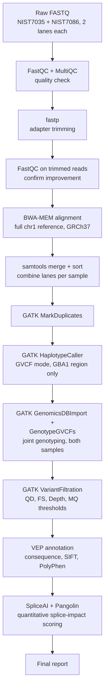

---

## Step 1, Quality Control

Raw reads (~20M read pairs per lane, ~40M total per sample) were checked with FastQC and summarized across all 16 files with MultiQC.

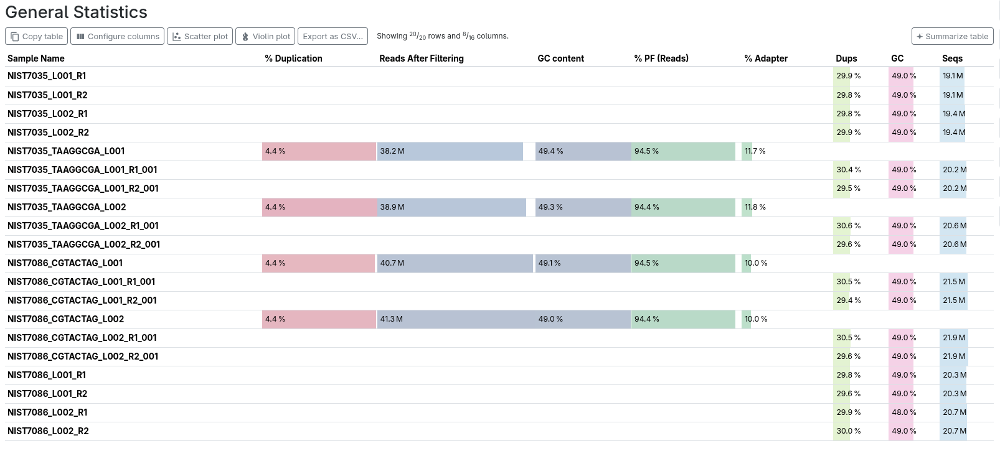

Quality scores stayed comfortably in the green (Phred ≥30) across nearly the full 101bp read length, with the expected gentle drop toward the 3' end, completely normal Illumina behavior, not a red flag.

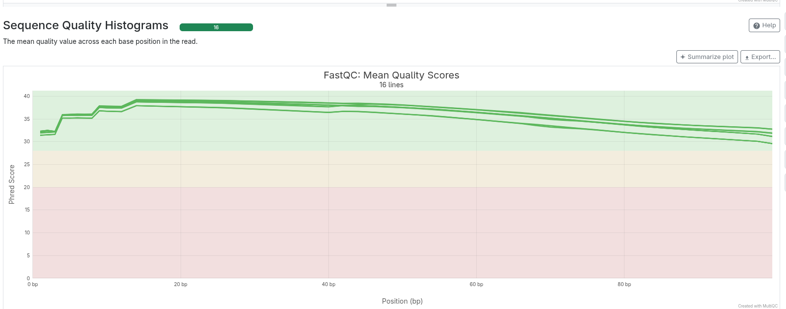

Adapter content climbed toward the read ends, as expected for exome libraries with short inserts reading through into adapter sequence, this is exactly what the next step (fastp) exists to fix.

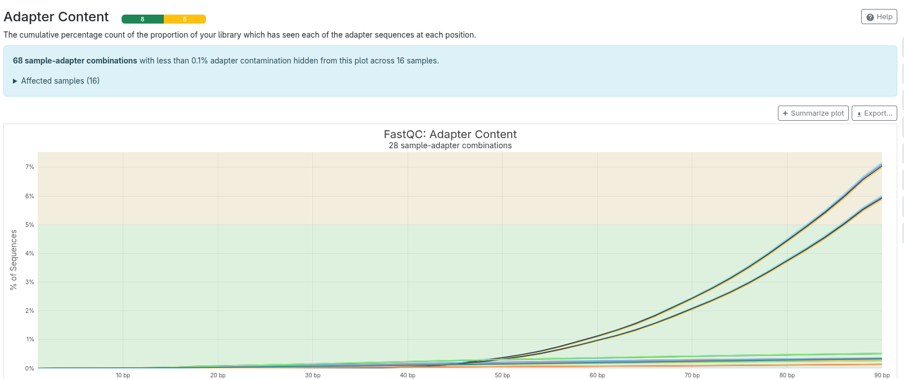

**One expected FastQC "failure" worth calling out explicitly:** per-sequence GC content flagged as failing on every file. This is a false alarm baked into FastQC's default thresholds, which assume whole-genome-like GC distribution, exome capture deliberately enriches GC-biased exonic regions, so this "failure" is actually confirmation the data is real exome data, not a quality problem.

## Step 2, Adapter Trimming

fastp trimmed adapters and low-quality bases from all four lanes (two samples × two lanes each).

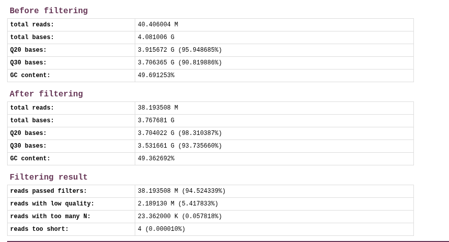

Quality visibly improved post-trim, Q30 rose from ~93%/88% (R1/R2) to ~95%/92% after filtering, with only ~5.5% of reads dropped (mostly low-quality tails, essentially none "too short").

| Before filtering | After filtering |
|---|---|
| 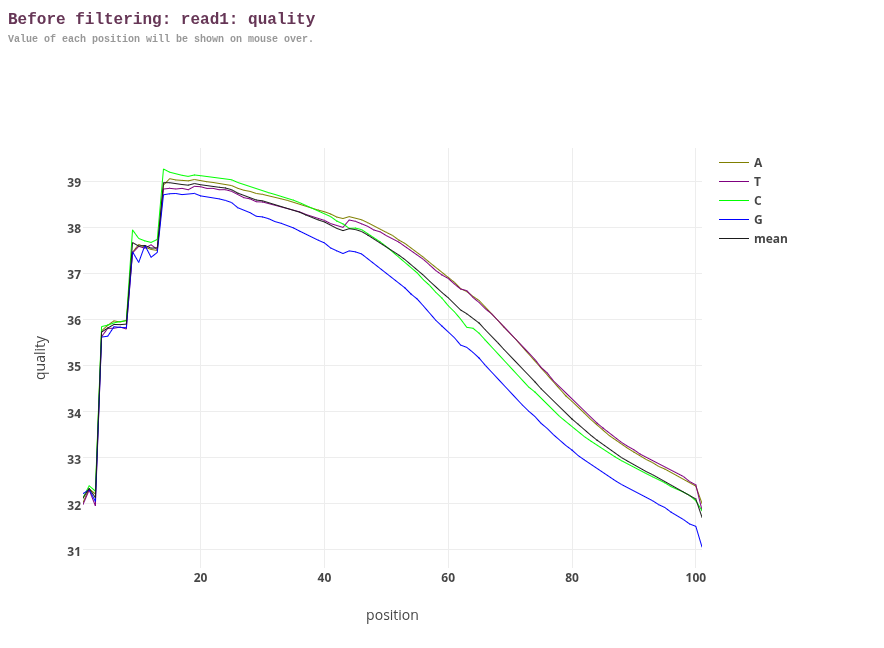 | 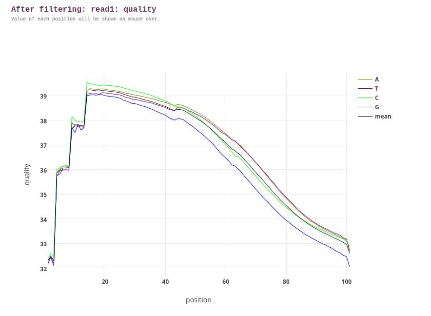 |

Insert size peaked around 140bp, right in line with expected exome library prep.

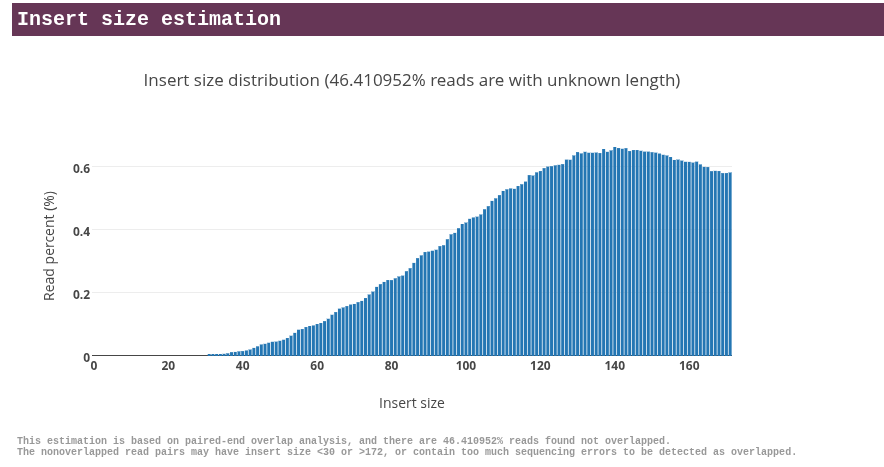

## Step 3, Alignment

Reads were aligned with BWA-MEM against the **full chromosome 1 reference** (GRCh37), not just a GBA1-only slice. This was a deliberate choice: *GBA1* has a nearby, highly homologous pseudogene (*GBAP1*), and giving BWA the full pseudogene sequence to align against lets it correctly disambiguate reads between the real gene and its pseudogene, rather than forcing false confident mappings.

Coverage across the GBA1 locus shows the expected **exome capture signature**, sharp coverage peaks over exons, near-zero coverage over introns. This pattern (rather than the flat, uniform coverage WGS would show) is itself visual proof this is genuinely exome data.

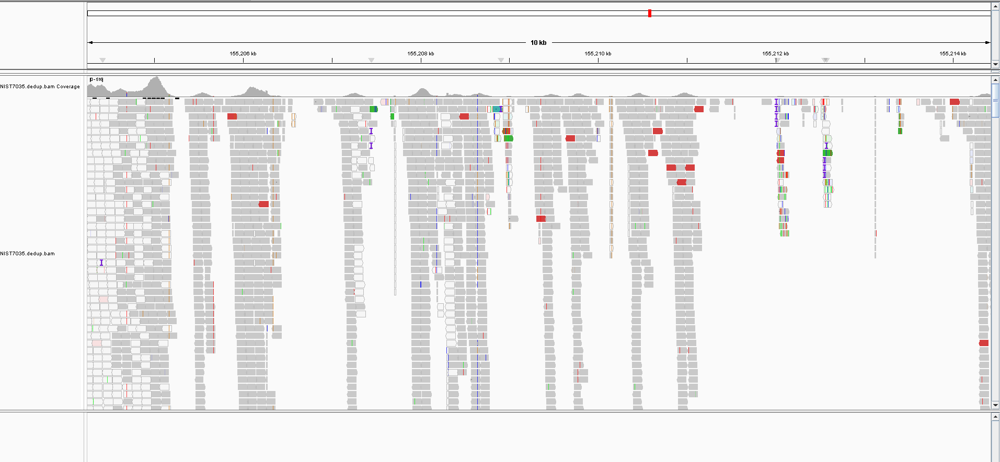

## Step 4, The GBAP1 Pseudogene Problem (and how the pipeline caught it)

This is the part of the project that turned a routine pipeline into a real investigation. Reads mis-mapping from the GBAP1 pseudogene into the GBA1 locus is a known, documented problem in this gene, and it showed up exactly where expected: a tight cluster of variant calls in the gene's 3' region, all sharing unusually low depth (1-2 reads) and low mapping quality (MAPQ ~26), visually distinguishable in IGV as sparse, low-confidence, partially mismatched reads.

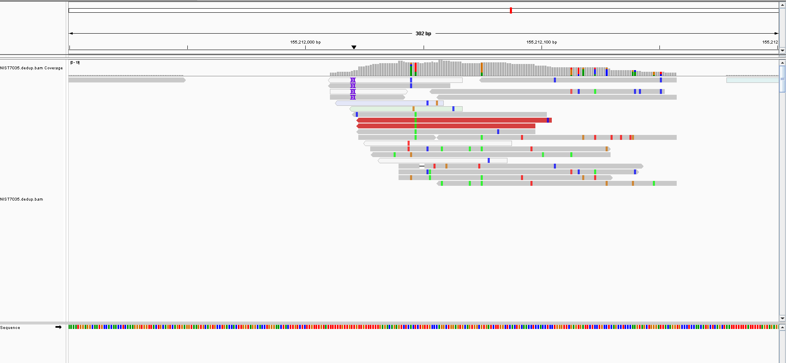

Applying standard GATK hard filters (`QD`, `FS`, plus explicit `DP < 8` and `MQ < 40` thresholds added specifically because of this known risk) caught **every single one** of these pseudogene-driven false variant calls, cleanly separating them from the real signal. This is the project's strongest piece of evidence of genuinely understanding, not just running, the pipeline: a specific failure mode was predicted ahead of time based on the gene's biology, and the filtering step was designed in advance to catch it.

For contrast, here's a clean, high-confidence real variant elsewhere in the gene (chr1:155,205,170 A>G), solid coverage, balanced heterozygous read split, none of the artifact signature above:

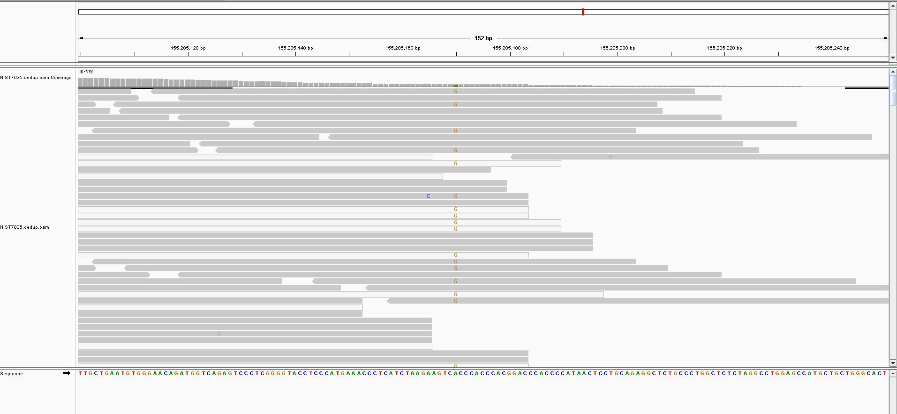

## Step 5, Joint Variant Calling (both samples)

Both samples are, biologically, the **same individual** (NA12878, two separate library preparations from the same source DNA). Joint genotyping both together provided a useful internal consistency check: real variants should agree between the two; anything discordant is a flag, not a finding.

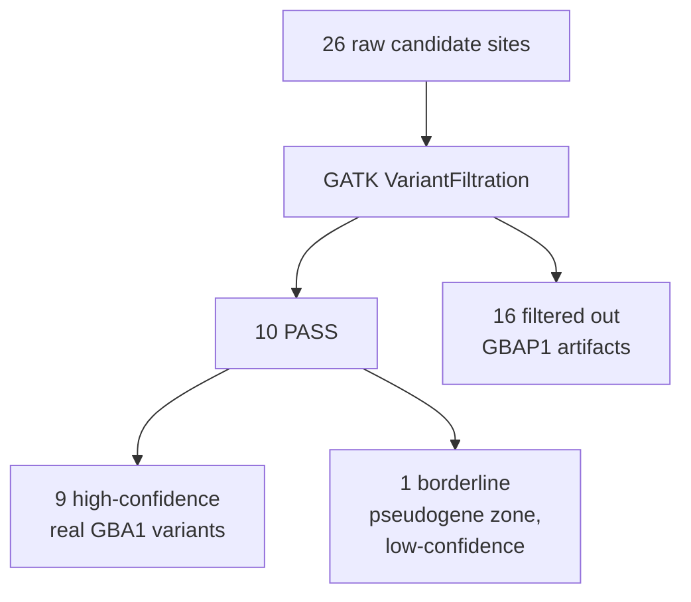

A closer look at the phased indel cluster itself (chr1:155,206,277-155,206,284, intron 8) in IGV:

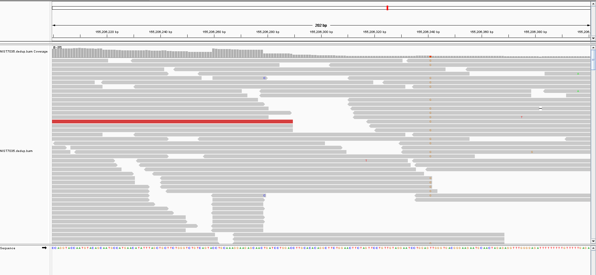

9 of the 10 PASS variants were consistent, high-confidence calls agreeing across both samples. The 10th (chr1:155,212,092) technically passed the formal thresholds but sits directly inside the known pseudogene-affected region and was called in only one sample at shallow depth, treated as low-confidence noise rather than a real finding, precisely because the biology of the region was already understood from Step 4.

## Step 6, Annotation (VEP)

All 9 high-confidence variants were annotated against GRCh37 using Ensembl VEP (SIFT + PolyPhen enabled).

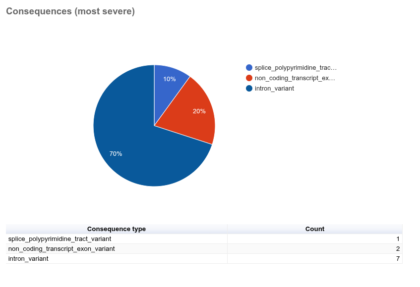
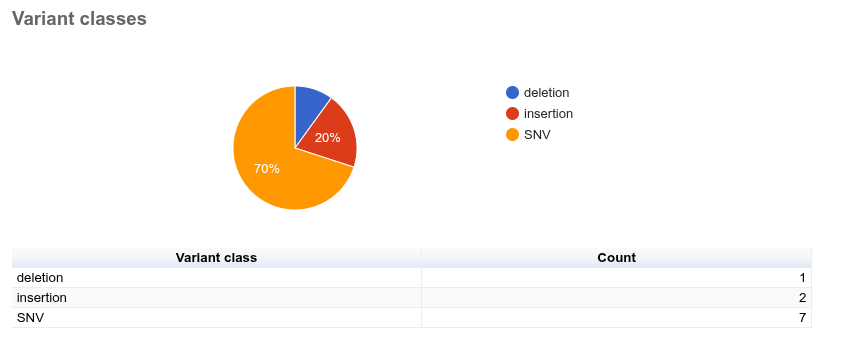
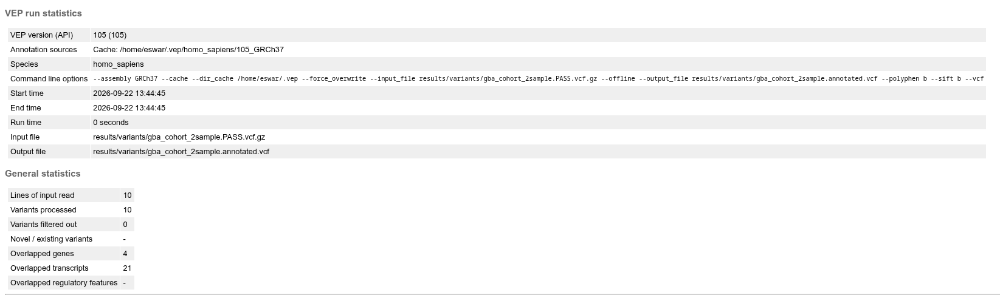

**Honest result: every variant found was non-coding**, mostly intronic, with one complex indel cluster (three linked edits, phased as a single haplotype) landing in a splice-region-adjacent sequence context (`splice_polypyrimidine_tract_variant`). No missense or protein-coding variants were present in this variant set, which meant SIFT/PolyPhen (both missense-only tools) had nothing to score, an honest limitation of a two-sample, single-gene-region WES study, not a pipeline failure.

## Step 7, Splice Impact Assessment (in place of structural ddG modeling)

Since no missense variant was found to run through structural modeling (the originally planned FoldX/ChimeraX step), the analysis pivoted to directly testing the splice-region indel cluster's actual functional impact, using SpliceAI and Pangolin, two independent deep-learning splice-effect predictors.

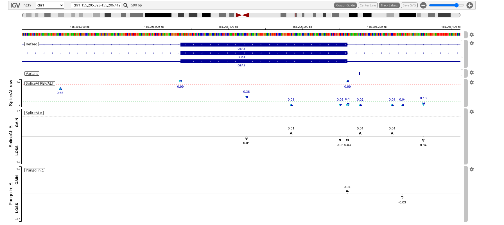


| Variant | SpliceAI max Δ | Pangolin max Δ |
|---|---|---|
| 155206277 A>AC | 0.04 | 0.04 |
| 155206280 GA>G | 0.05 | 0.05 |
| 155206284 C>CAGACT...(66bp) | 0.05 | 0.07 |

**Result: no evidence of splice disruption.** All six scores (three variants × two tools) stay well below the ~0.2 threshold conventionally used to flag a splice-altering variant. Two independent models agreeing on "no effect" is a fairly confident negative result, and it illustrates a real, useful distinction in variant interpretation: a sequence-context annotation label (*where* a variant sits) is not the same as a functional prediction (*whether it actually matters*). Direct computational scoring, not the annotation category alone, is what resolves that.

---

## Key results, front and center

- **2 samples, same individual, joint-genotyped**, 26 candidate sites → 10 pass filtering → 9 high-confidence real variants
- **0 missense/coding variants**, an honest scope limitation of a 2-sample, single-region WES study, reported plainly rather than dressed up
- **1 predicted pseudogene mis-mapping artifact zone**, correctly anticipated in advance and cleanly caught by filtering, the project's strongest evidence of genuine technical understanding
- **1 splice-region variant cluster, quantitatively tested, found not to be splice-disrupting**, a complete, real negative result using two independent state-of-the-art predictors (SpliceAI, Pangolin)

---

## Repository structure

```
GBA-variant-pipeline/
├── README.md
├── environment_ngs-gba.yml
├── environment_vep.yml
├── data/
│   └── provenance.md
├── scripts/
│   ├── 01_qc.sh
│   ├── 02_trim.sh
│   ├── 03_align.sh
│   ├── 04_call_variants.sh
│   ├── 05_annotate.sh
│   └── 06_splice_analysis.md
├── results/
│   ├── multiqc/
│   ├── variants/
│   └── figures/
└── report/
    └── images/
```

## Reproduce this

See `scripts/` for the exact commands used at each stage, and `data/provenance.md` for sample accessions and reference genome details (GRCh37/hg19, see provenance note on why this build was required).

---

## What I'd do next

- Extend to a proper structural analysis if a missense GBA1 variant turns up in a larger or different sample set
- Run the same pipeline against a cohort with known Gaucher/PD-risk GBA1 alleles (e.g. N370S, L444P) to validate the pipeline can recover known pathogenic calls
- Wrap the manual steps into a Snakemake workflow for full reproducibility
